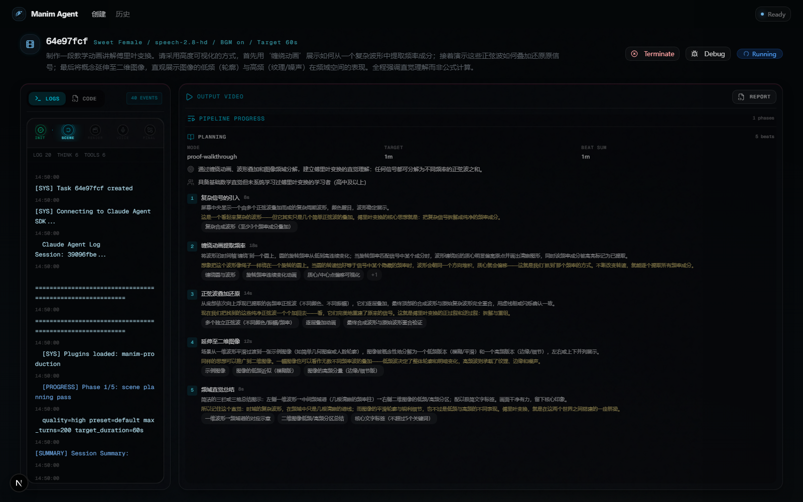
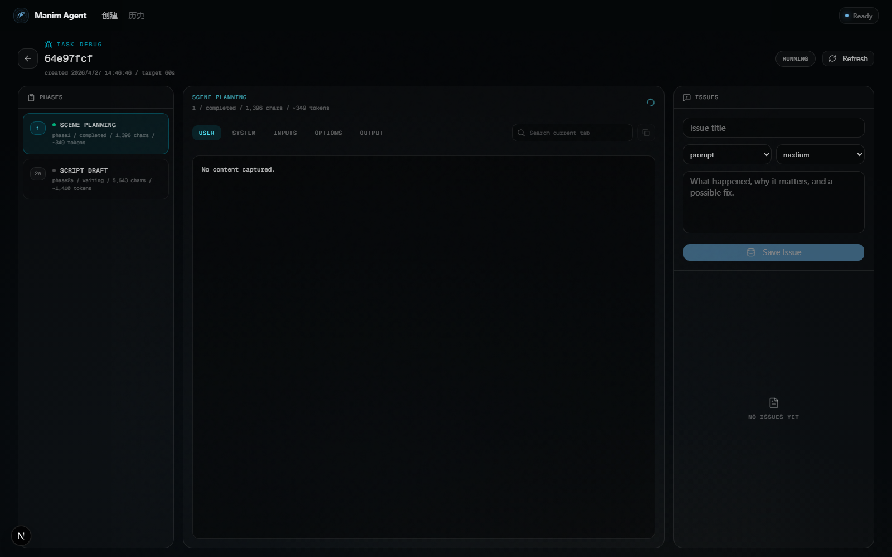
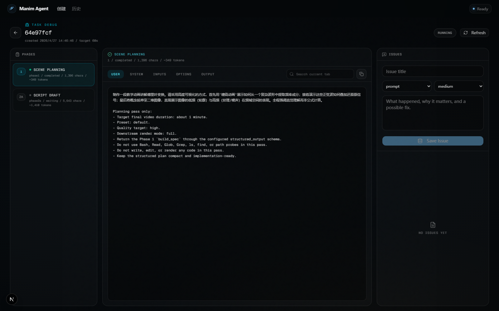
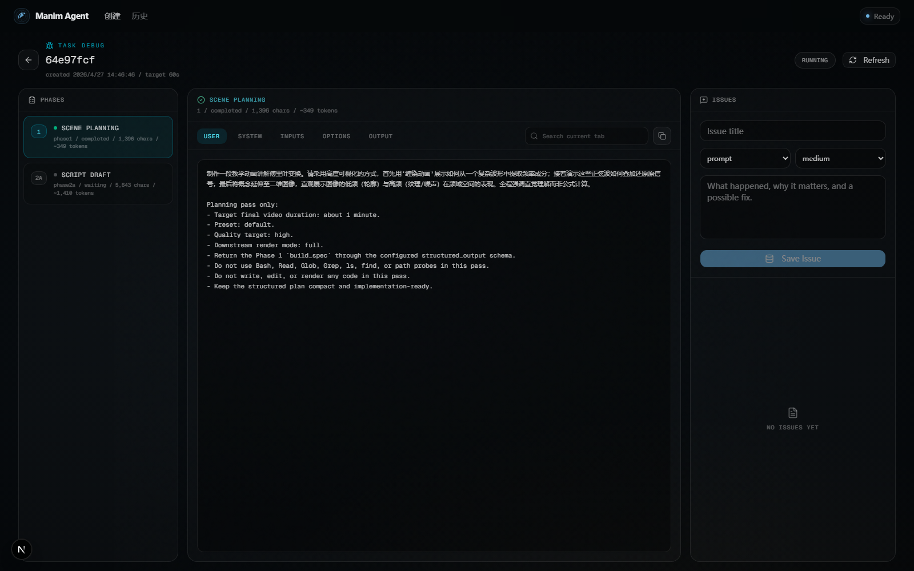
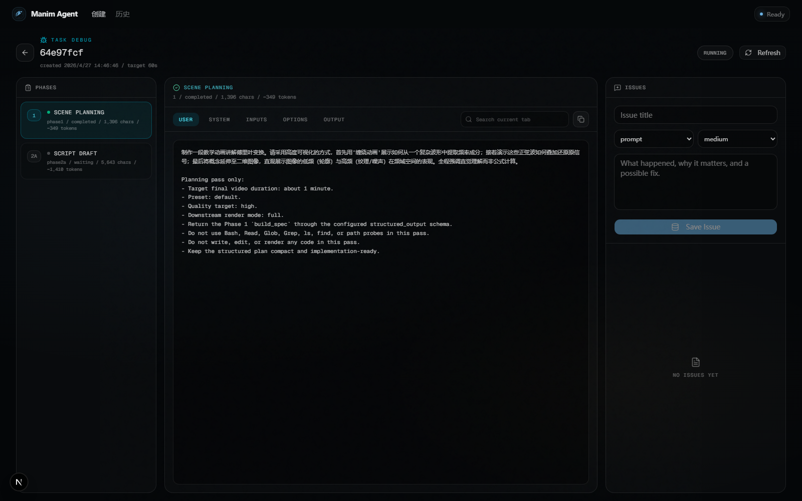
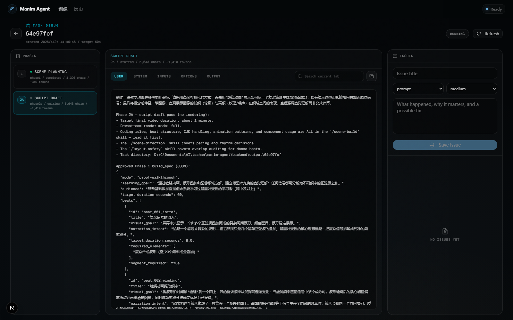
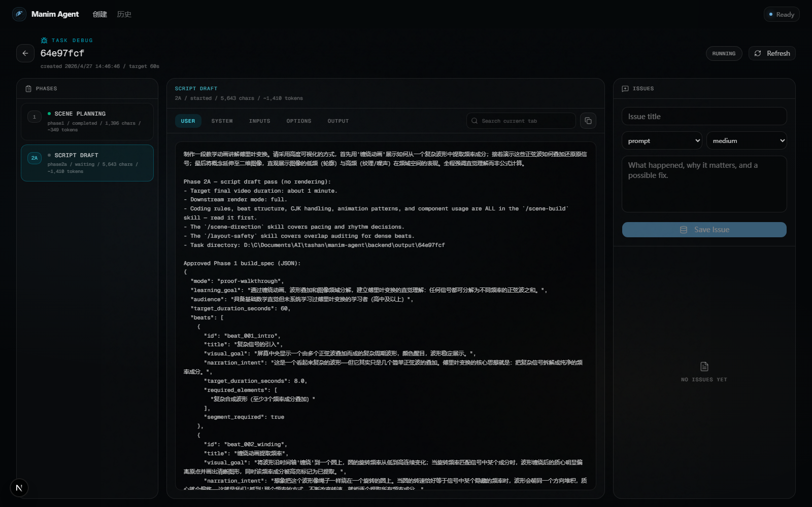

# Debug UI 团队协作指南

本文档用任务 `64e97fcf` 作为示例，说明如何结合任务详情页和 Debug 页进行排查、复盘和问题整理。目标是让产品、内容、动画、工程同学都能参与 debug，而不需要直接读数据库或翻后端日志。

示例入口：

- 任务页：`https://manim.gqy20.top/tasks/64e97fcf`
- Debug 页：`https://manim.gqy20.top/tasks/64e97fcf/debug`

## 1. 先看任务页：判断当前任务跑到哪里



任务页适合做第一轮判断：

| 区域 | 看什么 | 用来判断什么 |
| --- | --- | --- |
| 顶部任务状态 | `running` / `completed` / `failed` | 任务是否还在跑，是否已经进入终态 |
| 顶部成本、Turns 和模型 | `CNY`、`Turns`、`Model` | Agent 调用成本、对话轮数和计费模型是否异常 |
| `Debug` 按钮 | 进入 Debug 页 | 查看每一阶段的完整输入、提示词、结构化输出 |
| `Logs` | 实时事件和工具调用 | 判断卡在哪个阶段、是否频繁重试、是否有工具错误 |
| `Code` | 生成中的/最终脚本 | 判断 Manim 脚本是否符合教学和视觉预期 |
| 右侧预览/状态区 | 视频、输出状态 | 任务完成后快速检查最终结果 |

示例任务当前状态：

- 用户需求：讲解傅里叶变换，包含缠绕动画、正弦波叠加、二维图像频域直觉。
- 目标时长：60 秒。
- BGM：开启。
- 截图时状态：`running`。
- 已看到 Phase 1 规划完成，Phase 2A 脚本草稿已开始。

### Logs：如何阅读左侧任务日志

任务页左侧的 `Logs` 不只是普通文本日志，它会把 Agent SDK 的 SSE 事件拆成不同类型。团队成员可以按这些标签快速判断 Agent 正在做什么。

| 日志标签 | 含义 | 排查重点 |
| --- | --- | --- |
| `THINK` | 模型的思考/推理片段摘要 | 判断模型是否理解任务、是否在反复纠结同一个问题 |
| `Read` | Agent 读取文件或 skill 文档 | 判断是否读取了必要规则，例如 `/scene-build`、`layout-safety` |
| `Write` | Agent 写入新文件 | 判断是否生成了 `scene.py`、中间 JSON 或其他产物 |
| `Edit` | Agent 修改已有文件 | 判断是否在修复脚本、是否频繁改同一段代码 |
| `Output` | 结构化输出工具，通常是阶段最终结果 | 判断阶段是否真的产出了 schema 结果 |
| `RESULTS` / `OK` | 工具调用返回成功 | 判断 Read/Edit/Write 等工具是否正常完成 |
| `ERR` | 工具调用或日志中出现错误 | 优先展开查看错误内容和对应阶段 |
| `STEP` | 进度统计事件 | 查看当前 turn、tokens、tools、估算 CNY、耗时 |
| `PHASE` 分隔线 | 阶段切换提示 | 判断任务从规划、脚本、渲染、TTS、Mux 走到哪里 |

实用判断方式：

- 如果 `THINK` 很多但工具很少，可能是模型在规划或犹豫，先看 prompt 是否过宽。
- 如果 `Read` 很多，说明模型在加载技能/参考材料；如果一直读不写，可能需要缩短或明确阶段要求。
- 如果 `Edit` 很多，通常是在修复代码；结合 `ERR` 看是否被 Manim API 或布局问题卡住。
- 如果看到 `Output`，说明某个阶段大概率已经把结构化结果交回来了，下一步去 Debug 页看该阶段的 `output`。
- 如果 `STEP` 的 tokens、CNY、turn 持续上升但阶段不变，需要记录 issue，重点描述卡住阶段和最后几个工具事件。

## 2. 进入 Debug 页：看阶段、输入、提示词和输出



Debug 页的左侧是阶段列表。每一个阶段都代表一次关键 Agent 调用或流水线处理。

| 阶段 | 含义 | 主要排查对象 |
| --- | --- | --- |
| `1 Scene Planning` | 把用户需求整理成 build_spec | 教学目标、beat 拆分、时长分配是否合理 |
| `2A Script Draft` | 根据 build_spec 生成 Manim 脚本草稿 | 是否读了必要 skill，脚本结构是否合理 |
| `2B Render Implementation` | 实现与渲染修复 | 代码能否渲染、画面是否达到要求 |
| `3 Render Review` | 渲染质量检查 | 是否有视觉问题、遮挡、空白、节奏问题 |
| `3.5 Narration` | 解说词生成 | 是否覆盖所有 beat、语速和长度是否合适 |
| `4 Audio/TTS` | TTS 和音频时间线 | 音频是否生成、时长是否偏离 |
| `5 Mux` | 视频音频合成 | final.mp4 是否产出，音画是否对齐 |

### Phase 与 Skills 对照

每个 phase 的 system prompt 会规定它应该读取或参考哪些 runtime-injected skills。调试时，这张表可以帮助判断 Agent 的行为是否符合阶段预期。

| Phase | 主要 skills | 调试时怎么看 |
| --- | --- | --- |
| `1 Scene Planning` | 通常不读取 skill，重点是结构化规划 schema | 如果 Phase 1 去读文件、写代码或探测目录，说明阶段边界失守 |
| `2A Script Draft` | `/scene-build`、`/scene-direction`、`/layout-safety` | Logs 中应该看到先读 `/scene-build`；如果没有读，脚本规则可能没吃进去 |
| `2B Render Implementation` | `/scene-build`、`/layout-safety`，必要时结合 `/scene-direction` | 用于实现、修复 Manim 脚本、处理布局风险和渲染问题 |
| `3 Render Review` | `/render-review` | 用抽帧结果检查视觉质量、遮挡、空白、节奏和最终可懂度 |
| `3.5 Narration` | `/narration-sync` | 检查解说是否覆盖所有 beat，是否和画面节奏匹配 |
| `4 Audio/TTS` | 通常不需要 Agent skill，主要是 TTS 客户端和时间线 | 看音频分段、时长、字幕/BGM 路径和 TTS 错误 |
| `5 Mux` | 通常不需要 Agent skill，主要是 FFmpeg 合成 | 看 final.mp4、audio track、subtitle、BGM 合成是否成功 |

如果某个阶段反复失败，优先检查该阶段对应 skill 是否被读取、是否被读错路径，以及 user/system prompt 是否把 skill 的使用顺序说清楚。

左侧每个阶段还会显示：

- 阶段编号：如 `1`、`2A`。
- 状态：`completed`、`waiting`、`failed`。
- prompt 规模：字符数和估算 tokens。

这个信息适合快速发现异常：比如某一阶段 prompt 特别长、阶段一直 waiting、或者输出为空。

## 3. Output：给非技术同学看的结构化结果



`output` tab 默认使用 readable 视图，会把 JSON 转成更容易读的内容。

在 Phase 1 里重点看：

- `Learning Goal` 是否准确表达用户需求。
- `Beat Plan` 是否覆盖用户提出的所有重点。
- 每个 beat 的 `visual_goal` 是否能落到动画画面上。
- `target_duration_seconds` 总和是否接近目标时长。

示例任务的 Phase 1 拆成 5 个 beat：

1. 复杂信号的引入，8 秒。
2. 缠绕动画提取频率，18 秒。
3. 正弦波叠加还原，14 秒。
4. 延伸至二维图像，12 秒。
5. 频域直觉总结，8 秒。

这一版规划整体覆盖了用户的三个核心要求：缠绕动画、波形还原、二维图像低频/高频。

## 4. System / User / Inputs：定位“为什么 Agent 会这样做”

### System Prompt



`system` tab 用来看阶段规则。它回答的是：这个阶段被要求做什么、不能做什么。

Phase 1 的典型检查点：

- 是否明确“只做规划，不写代码”。
- 是否要求输出结构化 `build_spec`。
- 是否约束 beat 字段，避免 schema 乱掉。
- 是否传入了 preset、quality、render mode。

如果结果偏离阶段边界，比如 Phase 1 开始写代码，就优先看这里。

### Inputs



`inputs` tab 用来看结构化输入。它回答的是：这一阶段拿到了哪些事实。

重点检查：

- `user_text` 是否完整。
- `target_duration_seconds` 是否正确。
- `quality` / `preset` / `render_mode` 是否符合预期。
- 后续阶段是否拿到了上一阶段的 `build_spec`。

### User Prompt



`user` tab 是最终发给模型的用户侧提示词。它通常包含：

- 原始用户需求。
- 当前阶段任务说明。
- 上一阶段输出，如 build_spec。
- 当前任务目录。
- 本阶段的硬性要求。

在 Phase 2A 里，团队成员可以检查：

- build_spec 是否完整传入。
- 是否明确“no rendering”。
- 是否要求先读 `/scene-build` skill。
- 是否包含 timing gates。

## 5. Phase 2A：脚本草稿阶段怎么排查



Phase 2A 截图时还处于 `waiting`，所以 output 为空或显示等待。这种状态不是 bug，表示该阶段已经开始，但还没有写入完成快照。

如果 Phase 2A 完成后，重点检查：

- `scene_file` 是否存在。
- `scene_class` 是否正确。
- `implemented_beats` 是否覆盖 Phase 1 的所有 beat。
- `beat_timing_seconds` 是否满足时长门槛。
- `deviations_from_plan` 是否合理、是否有风险。
- `source_code` 是否出现明显布局、字体、性能或 Manim API 问题。

如果 Phase 2A 卡很久：

- 回任务页看 Logs 是否停在 Read/Edit/Write。
- 看 Debug 页 `system` 是否要求读取过多材料。
- 看 prompt tokens 是否过大。
- 看是否有复杂需求导致脚本一次性过长。

## 6. Issue 区：把观察转成可追踪的问题

Debug 页右侧是 issue 提交区。建议每次发现问题都在这里记录，而不是只发聊天消息。

推荐字段填写方式：

| 字段 | 填写建议 |
| --- | --- |
| 问题标题 | 一句话说明问题，例如“Phase 1 beat 过多导致总时长风险” |
| 分类 | 使用中文分类：`提示词`、`结构化输出`、`脚本结构`、`渲染执行`、`视觉质量`、`解说文案`、`语音合成`、`音视频合成`、`基础设施`、`前端界面`、`产品体验`、`其他` |
| 严重程度 | UI 显示为 `低` / `中` / `高` / `阻塞` |
| 描述 | 现象、影响、可能原因、建议修复 |

好的 issue 示例：

```text
问题标题: Phase 2A 未明确要求二维图像频域布局不要遮挡
分类: 提示词
严重程度: 中
描述:
用户要求二维图像展示低频轮廓和高频纹理。当前 build_spec 有该 beat，
但 Phase 2A prompt 没有额外强调多面板布局安全，可能导致图像、频谱、文字重叠。
建议在 Phase 2A 或 layout-safety skill 中加入二维频域布局检查。
```

提交 issue 时系统会自动关联：

- 当前 task id。
- 当前 phase。
- 当前 tab。
- prompt artifact path。
- 选中的文本片段，如果有。

## 7. 团队分工建议

| 角色 | 主要看哪里 | 输出什么 |
| --- | --- | --- |
| 产品/内容 | Phase 1 output、user prompt | 教学路径是否正确，是否漏掉用户需求 |
| 动画/视觉 | Phase 2A/2B output、Code、最终视频 | 画面是否能被看懂，节奏和布局是否合理 |
| 工程 | Logs、system prompt、inputs、output JSON | schema、阶段边界、工具调用和异常原因 |
| 质量检查 | Task 页状态、Debug issues、最终视频 | 复现步骤、严重程度、验收结果 |

## 8. 推荐调试流程

1. 打开任务页，确认状态、成本、turns、当前日志。
2. 点击 Debug，查看左侧阶段列表。
3. 先看最早异常阶段，不要直接跳到最后。
4. 在该阶段依次查看 `inputs`、`user`、`system`、`output`。
5. 如果 output 不合理，回看 user/system 判断是输入问题还是模型执行问题。
6. 如果 output 合理但最终视频有问题，重点看 Phase 2B、Render Review、TTS、Mux。
7. 把可复现观察写入 issue。
8. 修复后用同类任务验证，而不是只看单个任务。

## 9. 这个示例任务的初步观察

基于当前截图和 API 状态：

- Phase 1 规划质量较好，用户的三个核心点都被覆盖。
- 5 个 beat 总时长正好 60 秒，结构紧凑。
- Phase 2A 正在进行，尚不能判断脚本质量。
- Phase 2A prompt 已包含 skill 读取要求和 timing gates，方向是对的。
- 后续需要重点关注二维图像 beat：这一段容易出现布局拥挤、抽象过强或文字过多。

## 10. 常见问题速查

| 现象 | 可能原因 | 看哪里 |
| --- | --- | --- |
| Debug 页没有 phases | prompt artifacts 未生成或被清理 | Debug notice、后端 cleanup、任务目录 |
| 某阶段 output 为空 | 阶段还在 running/waiting，或失败前未产出 | 左侧状态、Logs、该阶段 error |
| 最终视频过长 | TTS timeline 比 Manim render 长 | Phase 4 output、pipeline_output timeline |
| 画面重叠 | Phase 2A/2B 布局约束不足 | source_code、layout-safety、Render Review |
| 用户需求漏掉 | Phase 1 build_spec 漏拆 | Phase 1 output、user prompt |
| 成本/Turns 偏高 | prompt 太大、重试多、阶段循环 | 任务页 CNY/Turns/Model、Logs、debug metrics |
